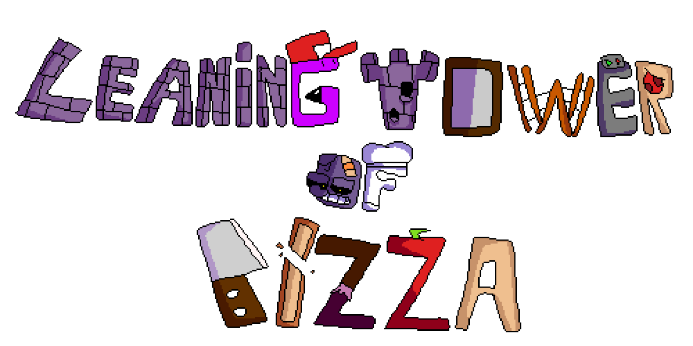

    

    A slice from the past!

## About

The Leaning Tower of Pizza is a PT fangame dedicated to paying homage to Pizza Tower's beta days. 4 worlds, 17 levels, 5 bosses. Yea.
In its current state, while it does work and is playable, it is very buggy, primarily due to various differences between Godot and GameMaker.

## Credits

We do not own and didn't make any of Pizza Tower's original assets that are used in this project.

* Pizza Tower is made by Tour De Pizza. (McPig and Sertif)
* Pizza Tower's composers are: Mr. Sauceman, ClascyJitto and POST ELVIS.
* [Godot Tower](https://github.com/NightHackreal/TheLeaningTowerofPizza) is made by basiccube.

The Leaning Tower of Pizza team:
* Creator/Conceptualizer: NightHack
* Director: NightHack
* Composers: RooGoesBoom, IronCzyk, Westboiiz, Bambi Enjoyer
* Spriters: RooGoesBoom, Takiallah Jamai, Bashuster, Bambi Enjoyer, Naffie Camara
* Level Designers: NightHack, Definetly Real Sgt. Winter
* Programmers: Ivo, basiccube
* Logo by: Bambi Enjoyer (Original by Naffie Camara)

If you don't own [Pizza Tower on Steam](https://store.steampowered.com/app/2231450/Pizza_Tower/) yet, you can [support the developers](https://store.steampowered.com/app/2231450/Pizza_Tower/) by [buying the game](https://store.steampowered.com/app/2231450/Pizza_Tower/).  
Come on, just [buy the game](https://store.steampowered.com/app/2231450/Pizza_Tower/)! You know you want [it](https://store.steampowered.com/app/2231450/Pizza_Tower/)!

The following projects are used, which are licensed under the MIT License:

* [Godot Palette Swap Shader (Godot 3.x version)](https://github.com/KoBeWi/Godot-Palette-Swap-Shader/tree/3.x)
* [BitmapTextureFont](https://github.com/Digital-Sin/BitmapTextureFont)
* [Godot Console](https://github.com/quentincaffeino/godot-console)

The licenses for these projects can be found in their respective folders.
